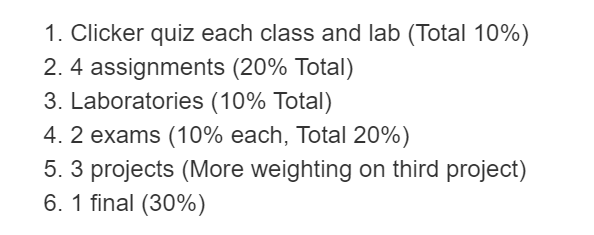

```{r, include = FALSE}
knitr::opts_chunk$set(
  collapse = TRUE,
  comment = "#>"
)
```

```{r setup }
library(Lab1Intro)
```

## Links

[Documentation about package making](http://r-pkgs.had.co.nz/vignettes.html)

[My Github repository](https://github.com/sjansson/MATH-4793)


## These are the formulae which are executed by the functions found in this package:

### Sample Mean Vector 

$$  \bar{x}_k = \frac{1}{n} \sum_{j=1}^{n}{x_{jk}} \quad k=1,2,...,p$$

### Sample (Biased) Covariance Matrix

$$ s_{ik} = \frac{1}{n} \sum_{j=1}^{n} (x_{ji} - \bar{x}_i)(x_{jk}- \bar{x}_k) \quad i=1,2,...,p, \quad k=1,2,...,p$$

### Sample Correlation Matrix

$$ r_{ik} = \frac{s_{ik}}{\sqrt{s_{ii}}\sqrt{s_{kk}}} = \frac{ \sum_{j=1}^{n} (x_{ji} - \bar{x}_i)(x_{jk}- \bar{x}_k)} { \sqrt{\sum_{j=1}^{n} (x_{ji} - \bar{x}_i)^2} \sqrt{\sum_{j=1}^{n} (x_{jk} - \bar{x}_k)^2}} $$

## This shows the matrix math method to the above formulas, with X being an $nxp$ matrix of data:

### Sample Mean

$$ \bar{\textbf{x}} = \frac{1}{n} \textbf{X}'\textbf{1}$$

### Sample Covariance

$$ \textbf{S} = \frac{1}{n-1} \textbf{X}' \big( \textbf{1} - \frac{1}{n} \textbf{11}' \big) \textbf{X}$$

### Sample Correlation

Let D be a $pxp$ matrix

$$
\textbf{D}^{1/2} = 
\begin{pmatrix}
  \sqrt{s_{11}} & 0 & \ldots & 0 \\
  0 & \sqrt{s_{22}} & \ldots & 0 \\
  \vdots & \vdots & \ddots & \vdots \\
  0 & 0 & \ldots & \sqrt{s_{pp}}
\end{pmatrix}
$$

Invert the matrix.

$$
\textbf{D}^{-1/2} = 
\begin{pmatrix}
  \frac{1}{\sqrt{s_{11}}} & 0 & \ldots & 0 \\
  0 & \frac{1}{\sqrt{s_{22}}} & \ldots & 0 \\
  \vdots & \vdots & \ddots & \vdots \\
  0 & 0 & \ldots & \frac{1}{\sqrt{s_{pp}}}
\end{pmatrix}
$$

Since

$$
\textbf{S} = 
\begin{pmatrix}
  s_{11} & s_{12} & \ldots & s_{1p} \\
  \vdots & \vdots & \ddots & \vdots \\
  s_{1p} & s_{2p} & \ldots & s_{pp}
\end{pmatrix}
$$

and

$$
\textbf{R} = 
\begin{pmatrix}
  \frac{s_{11}}{\sqrt{s_{11}}\sqrt{s_{11}}} & \frac{s_{12}}{\sqrt{s_{11}}\sqrt{s_{22}}} & \ldots & \frac{s_{1p}}{\sqrt{s_{11}}\sqrt{s_{pp}}} \\
  \vdots & \vdots & \ddots & \vdots \\
 \frac{s_{1p}}{\sqrt{s_{11}}\sqrt{s_{pp}}} & \frac{s_{2p}}{\sqrt{s_{22}}\sqrt{s_{pp}}} & \ldots & \frac{s_{pp}}{\sqrt{s_{pp}}\sqrt{s_{pp}}}
\end{pmatrix}
=
\begin{pmatrix}
  1 & r_{12} & \ldots & r_{1p} \\
  \vdots & \vdots & \ddots & \vdots \\
  r_{1p} & r_{2p} & \ldots & 1
\end{pmatrix}
$$

we have

$$ \textbf{R}= \textbf{D}^{-1/2}\textbf{SD}^{-1/2}$$

## Example With Table 1.2

### The Sample Mean Function
```{r echo=FALSE}

##load in data

table <- read.table("T1-2.DAT")
```

```{r}
## Sample Mean function
SampleMeans(x = table)
```

### The (Biased) Covariance Matrix Function
```{r}
SampleCov(x = table)
```

### The Correlation Matrix
```{r}
SampleCor(x = table)
```

## What is the assessment for MATH 4793?


